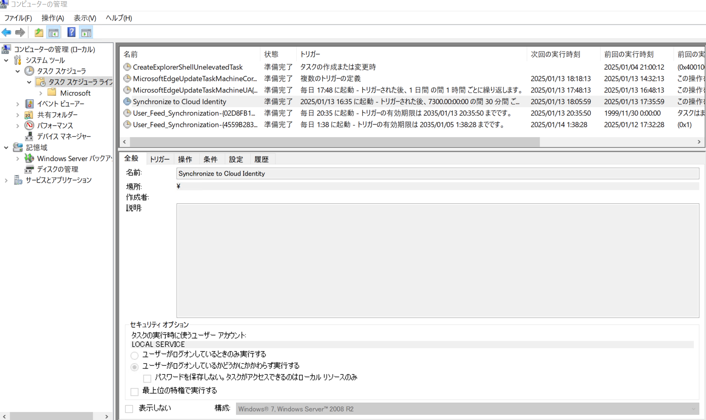
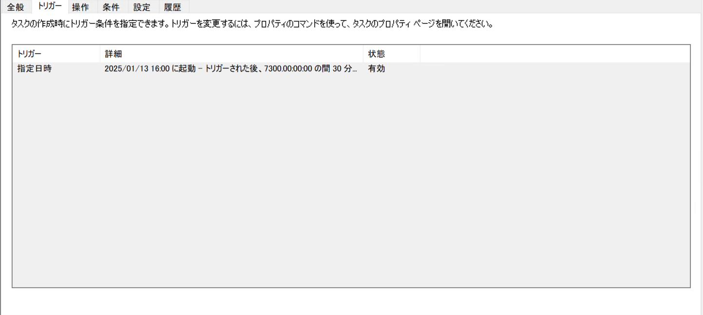
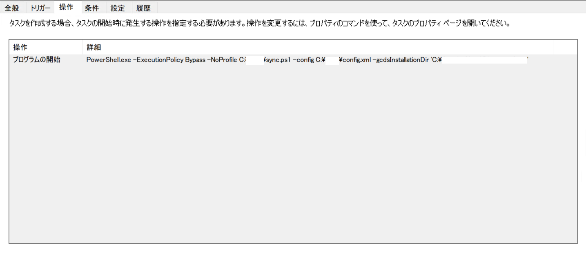
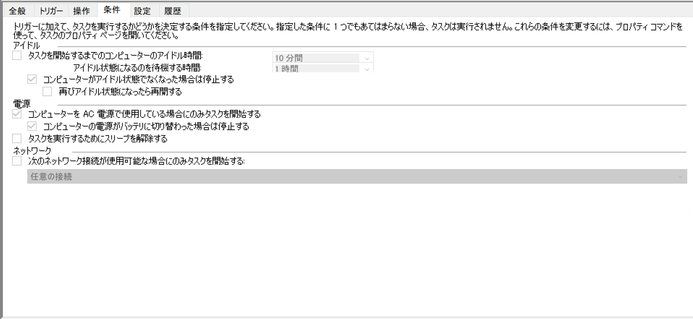
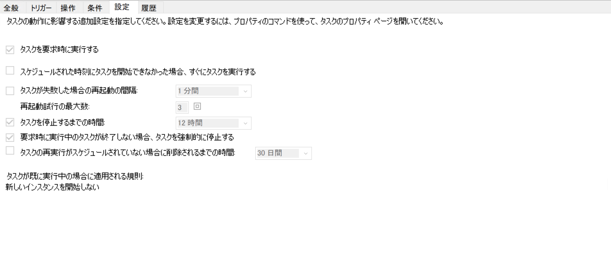
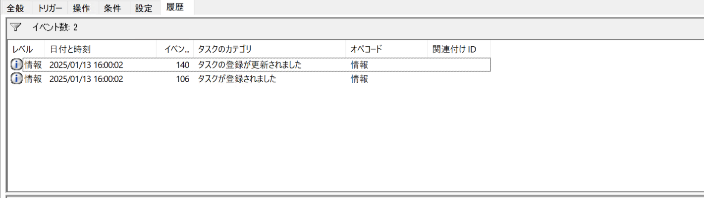

# 設定と自動同期

プロビジョニングのスケジュールを設定する
```
https://cloud.google.com/architecture/identity/federating-gcp-with-active-directory-synchronizing-user-accounts?hl=ja#scheduling
```
↑こっちを見ましょう。

GCDS の同期オプション
```
https://support.google.com/a/answer/6152421?hl=ja&ref_topic=6152423&sjid=4267988734967960288-AP
```
↑こっちには全然情報ない。


administrator は使わない。<br>
下記全部、代替管理者ユーザBでの作業<br>
タスク実行はLOCAL SERVICE システムアカウント<br>
AD側のGCDSアカウントはただのユーザC<br>

下記設定ならパスはそのままでOK<br>
文字化け対策は必要<br>
Directory Syncのインストール先がデフォルト(下記直下にsync-cmdがある) <br>
```
C:\Program Files\Google Cloud Directory Sync
```
config と sync.ps1を以下へ保存
```
c:\ProgaramData\gcds
```

## その他を先に
ログファイルの出力先：Directory Sync(Congig.xml)と同じになる。Loggingタブで指定してる場所です。<br>
レポート出力先：出力されない。<br>
　　　　　　　　Directory Sync 手動実行だと出力される、<br>
　　　　　　　　実行ユーザの C:\Users\<実行ユーザ名>\GADS_reports 配下のhtmlが出力されない。<br>
　　　　　　　　内容は、手動実行の画面で表示されるサマリです。<br>
　　　　　　　　同等の内容は、上のログに入ってます。<br>
認証：ユーザCのパスワード変更すると下記4)再実行になるようです。<br>
　　　※ config.xmlの場所変更すると再認証になるので、結局下記4) 再実行

おかしくなったら、やり直せば全然OKです。

## 手順
1) Configuration Manager から一度同期(シミュレートでも多分OK))を成功させておく。<br>
   ここで config.xml と sync.ps1 の保存先を決めます。<br>
   特になければ上記デフォルト、デフォルト以外なら下記5)で要修正対応<br>
   この config.xml 指定して同期を成功させておく。<br>
   config.xml の場所変えるとDirectory Syncは再認証必要　<br>

2) Powershell 管理者権限で実行して、下記成功すること確認
```
import-module ActiveDirectory
```
3) メモ帳で sync.ps1 保存 <br>
   上記1)の config.xml と同じ場所へ保存

   23行目下記の感じで直さないとOUに日本語いると普通にエラー<br>
   confix.xmlがBOM無し→ここで文字コード判定ミスってるらしい、config.xml.autodiscoverもBOM無し<br>
   変更前
   ```
   $dom = [xml](Get-Content $rawConfigPath)
   ```
   変更後
   ```
   $dom = [xml](Get-Content -Encoding UTF8 $rawConfigPath)
   ```
4) コピペ実行でOK <br>
   ユーザCのパスワード変更したら多分再実行

5) タスク登録 上記デフォじゃないと修正必要 <br>
   2行目の 変数が config.xml と sync.ps1 置き場 <br>

   5行目の 末尾下記を sync-cmd のあるパスへ修正
   '$Env:Programfiles\Google Cloud Directory Sync'

   以下実行してsync-cmd あればデフォなので修正不要
   ```
   cd "$Env:Programfiles\Google Cloud Directory Sync"
   dir
   ```
   10行のminutes 60 → 30 でEntra 同等(1～6h普通らしい？)

   ps1にして実行<br>
   →　これ修正して再度登録する場合は、事前にタスク削除

6) タスクスケジューラの登録状況
   一回実行してみる。








終わり。

